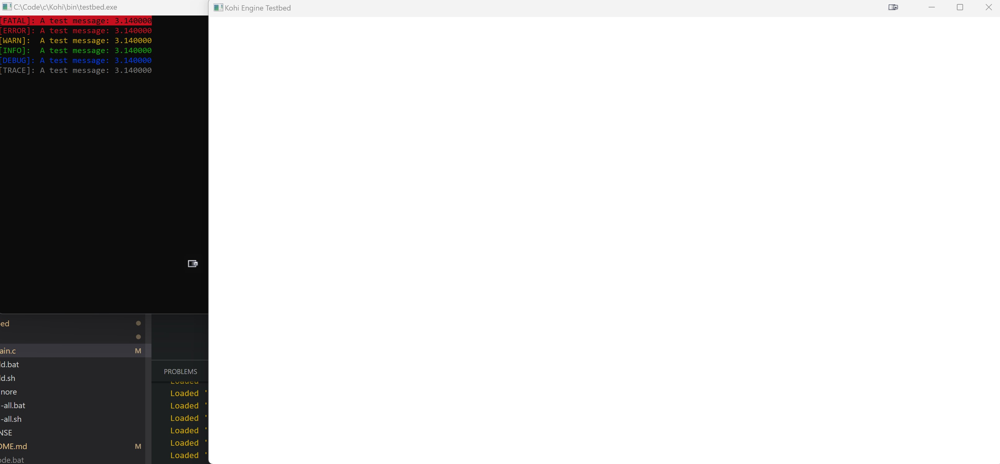

# platform.h

# platform_win32.c 
- windows.h, windowsx.h(?)
- Fill out the functions defined from platform.h
- Refer to Win32 API documentation
- Use standard library for memory allocation for now (Will change from malloc to something else later)

# Result Screen
- 

# Resources
- https://github.com/travisvroman/kohi/tree/ca0600eaefd11ed674c5a4642fb13ce17a96656f
- MSDN for Win32 API 